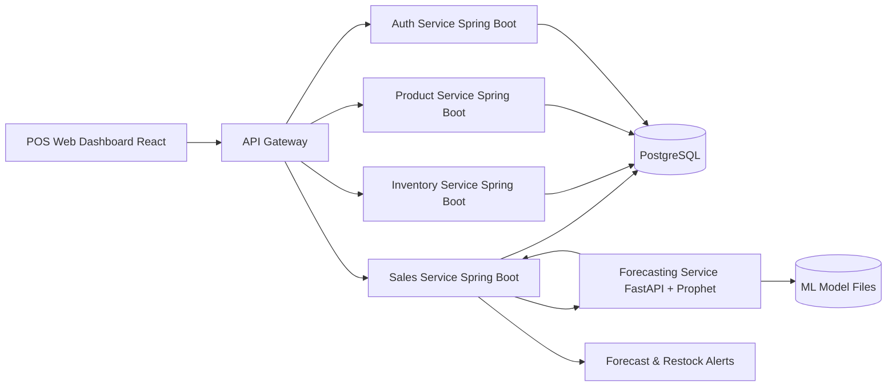
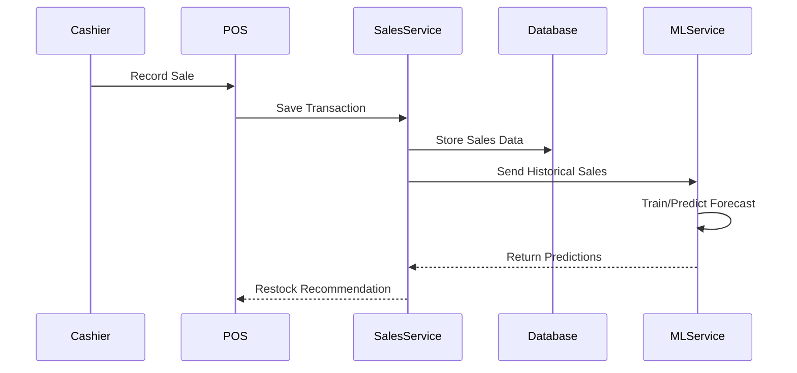
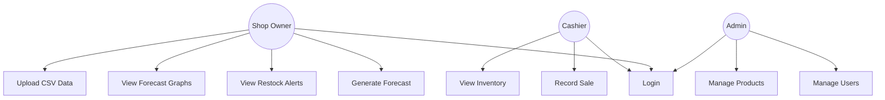
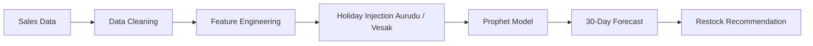
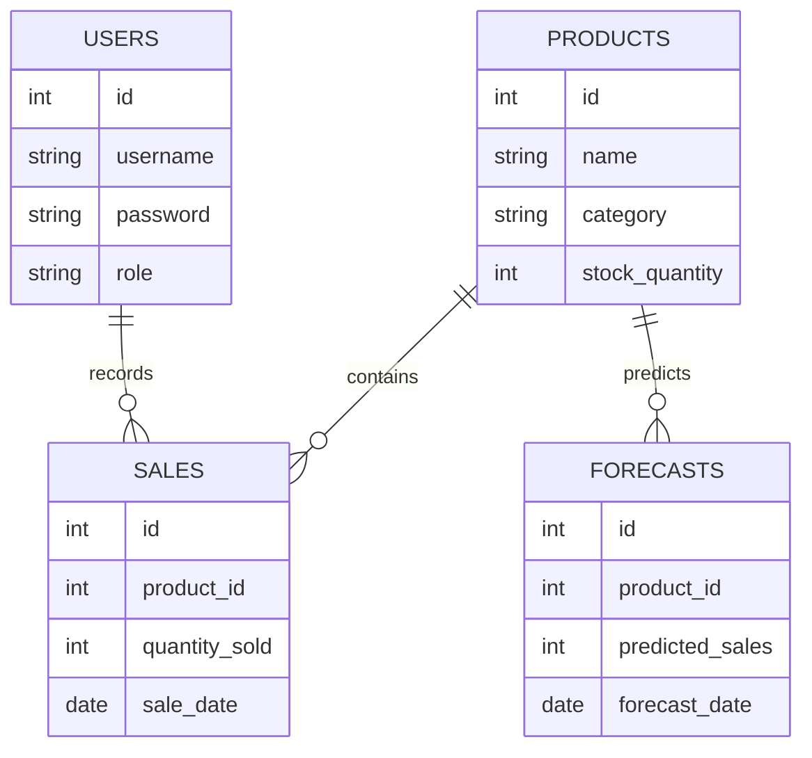
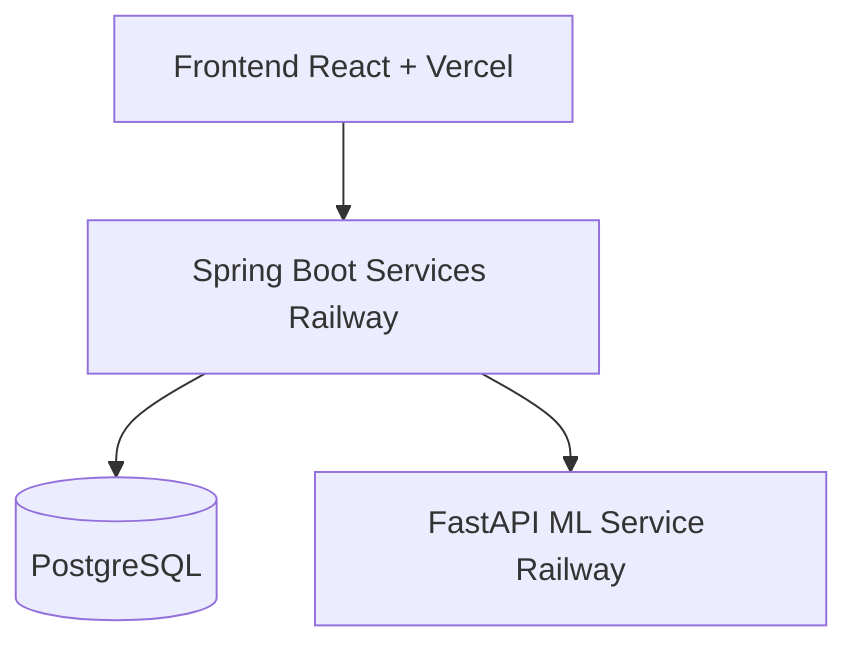

# StockIQ — Full System Architecture & Development Overview

## HND Software Engineering Final Project

---

# 1. Project Vision

StockIQ is an AI-powered inventory intelligence platform designed for Sri Lankan SMEs.

The system combines:

- A lightweight POS system
- Spring Boot microservices
- A machine learning forecasting engine
- Inventory intelligence and restock recommendations

The core goal of the system is:

> Predict future inventory demand using sales data.

---

# 2. Main System Idea

The system flow is:

```text
POS System
     ↓
Sales Data Collection
     ↓
Database Storage
     ↓
ML Forecasting Engine
     ↓
Future Sales Predictions
     ↓
Restock Recommendations
```

---

# 3. Recommended Technology Stack

| Component | Technology |
|---|---|
| Frontend | React |
| Backend | Spring Boot Microservices |
| Database | PostgreSQL |
| ML Service | FastAPI + Prophet |
| Charts | Recharts |
| Version Control | GitHub |
| Containerization | Docker |
| Deployment | Railway / Render |
| CI/CD | GitHub Actions |

---

# 4. Why This Architecture?

The project uses two separate ecosystems:

## Spring Boot
Handles:

- POS operations
- Inventory management
- Product management
- Authentication
- Business logic

---

## FastAPI
Handles:

- Machine learning
- Forecast generation
- Model inference
- Prediction APIs

---

This architecture is good because:

- Clean separation of concerns
- Easier debugging
- Easier scaling
- Real enterprise architecture style
- Better portfolio value for internships

---

# 5. Simplified Microservice Architecture

The system should NOT become overly complex.

Avoid:

- Kafka
- Kubernetes
- RabbitMQ
- Service Mesh
- Distributed transactions

For HND level:

> Simple REST microservices are enough.

---

# 6. Recommended Services

| Service | Responsibility |
|---|---|
| Auth Service | Authentication and JWT |
| Product Service | Product management |
| Sales Service | Sales transactions |
| Inventory Service | Inventory and restock logic |
| Forecasting Service | ML predictions |

---

# 7. High-Level System Architecture



---

# 8. Forecasting Workflow



---

# 9. Use Case Diagram



---

# 10. Machine Learning Pipeline



---

# 11. Dataset Structure

The ML model requires:

| ds | y |
|---|---|
| 2025-01-01 | 12 |
| 2025-01-02 | 15 |

Where:

- ds = date
- y = sales quantity

---

# 12. Feature Engineering

The forecasting model should learn:

| Feature | Purpose |
|---|---|
| Weekends | Detect weekend spikes |
| Payday cycles | Detect monthly demand increases |
| Aurudu | Detect festive demand |
| Vesak | Seasonal behavior |
| Weather | Rain impact |

---

# 13. ML Workflow

```text
Sales Data
    ↓
Cleaning
    ↓
Feature Engineering
    ↓
Holiday Injection
    ↓
Train Prophet Model
    ↓
Generate Forecast
    ↓
Evaluate Accuracy
```

---

# 14. Database ER Diagram



---

# 15. Recommended Development Timeline

## Weeks 1–2

- Learn Prophet
- Create synthetic sales dataset
- Train first forecasting model
- Generate prediction graphs

---

## Weeks 3–4

- Build Spring Boot microservices
- Create PostgreSQL database
- Build REST APIs

---

## Weeks 5–6

- Export ML model through FastAPI
- Connect Spring Boot services with ML service

---

## Weeks 7–8

- Build React dashboard
- Create lightweight POS UI
- Display charts and alerts

---

## Weeks 9–10

- Dockerize services
- Deployment setup
- Basic CI/CD pipeline

---

# 16. Recommended Deployment Architecture



---

# 17. Important Technical Advice

The team should avoid:

- Complex distributed systems
- Kubernetes
- Event streaming
- Large-scale infrastructure
- Overengineering

The project should remain:

> Small, stable, modular, and fully functional.

---

# 18. Final Recommendation

The strongest part of this project is not the POS system.

The strongest part is:

> Sri Lankan inventory forecasting intelligence.

The POS system should only support:

- Sales recording
- Inventory updates
- Historical data collection

The forecasting engine should remain the core innovation of the project.

---

# 19. Final Goal

The ideal final demo should work like this:

```text
Cashier records sale
        ↓
Inventory updates
        ↓
Sales data stored
        ↓
ML model predicts future demand
        ↓
System recommends restocking
```

This demonstrates:

- Machine learning
- Forecasting
- Microservice architecture
- Inventory intelligence
- Data engineering
- Full-stack software engineering
- DevOps workflow understanding