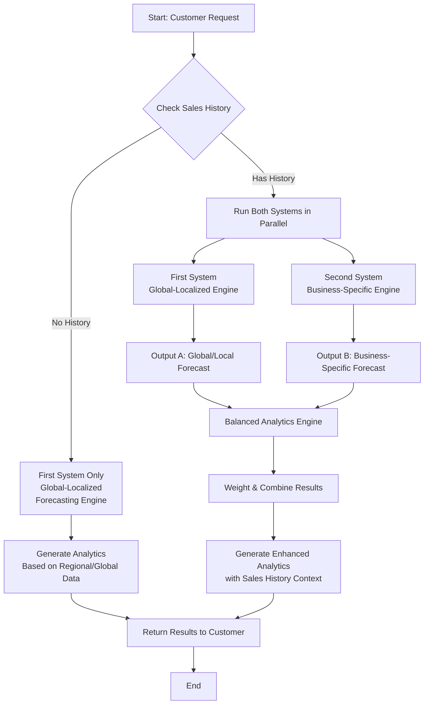

# 26-May-2026

Based on my understand at the moment, this project contains 2 parts.

### 1. Global Localized Forecasting Engine

### 2. Business-Specific Forecasting Engine

Currently, I don't have any idea on how to keep this **two sections as a single product** or **weather its possible**.

First, I thought I will start doing the first phase of the project which is the `Global Localized Forecasting Engine`. I generated a synthetic dataset for this with the below structure,

| week_number | month     | province      | product_name | category           | avg_temperature_level | rainfall_level | tourism_level | payday_week | holiday_type | festival_season | school_season | urbanization_level | avg_income_level | demand_score | estimated_units_sold |
| ----------- | --------- | ------------- | ------------ | ------------------ | --------------------- | -------------- | ------------- | ----------- | ------------ | --------------- | ------------- | ------------------ | ---------------- | ------------ | -------------------- |
| 36          | September | North Western | Wheat Flour  | Cooking Essentials | Medium                | Low            | Low           | Yes         | Poya         | Yes             | No            | Medium             | Medium           | 268.7        | 347                  |

Even though I feel like these 2 models are 2 separate models, I think they can be better if **they work together**.

Because the first section of the project doesn't provide much information and It just there to provide information about products trending in that area. The second section provide more details by analyzing existing sales history and tell what products on what quantity needed to be restocked.

So, the project idea is still unclear for me.

Now I decide to make these 2 sections into a single system. So when a customer doesn't have a sales history they will still be able get analytic information via [first system](#1-global-localized-forecasting-engine) and when they have sales history, they will get a more balanced analytic with both systems including the [second system](#2-business-specific-forecasting-engine).

The baseline model is created for the **global localized engine** using multiple linear regression model.
At **base level** the model shows a,
$$ \text{r}^{2} = 0.18244099437092332 $$
$$ \text{mean absolute error} = 183.25608590060762 $$

- The $\text{r}^{2}$ value of **0.182** define that the model only explain **18%** on the demand variations.
- The $\text{mean absolute error}$ value of **183.256** define that the model's average predictions are off by 183.256.
