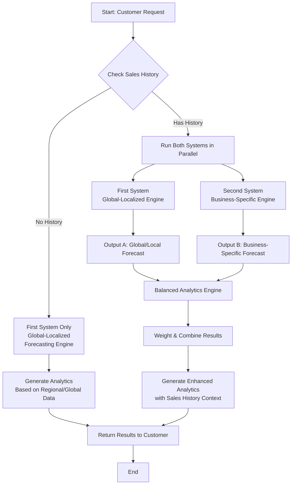

# 26-May-2026

Based on my understand at the moment, this project contains 2 parts.

### 1. Global Localized Forecasting Engine

### 2. Business-Specific Forecasting Engine

Currently, I don't have any idea on how to keep this **two sections as a single product** or **weather its possible**.

First, I thought I will start doing the first phase of the project which is the `Global Localized Forecasting Engine`. I generated a synthetic dataset for this with the below structure,

| week_number | month     | province      | product_name | category           | avg_temperature_level | rainfall_level | tourism_level | payday_week | holiday_type | festival_season | school_season | urbanization_level | avg_income_level | demand_score | estimated_units_sold |
| ----------- | --------- | ------------- | ------------ | ------------------ | --------------------- | -------------- | ------------- | ----------- | ------------ | --------------- | ------------- | ------------------ | ---------------- | ------------ | -------------------- |
| 36          | September | North Western | Wheat Flour  | Cooking Essentials | Medium                | Low            | Low           | Yes         | Poya         | Yes             | No            | Medium             | Medium           | 268.7        | 347                  |

Even though I feel like these 2 models are 2 separate models, I think they can be better if **they work together**.

Because the first section of the project doesn't provide much information and It just there to provide information about products trending in that area. The second section provide more details by analyzing existing sales history and tell what products on what quantity needed to be restocked.

So, the project idea is still unclear for me.

Now I decide to make these 2 sections into a single system. So when a customer doesn't have a sales history they will still be able get analytic information via [first system](#1-global-localized-forecasting-engine) and when they have sales history, they will get a more balanced analytic with both systems including the [second system](#2-business-specific-forecasting-engine).



## Linear Regression Baseline Model

The baseline model is created for the **global localized engine** using multiple linear regression model.
At **base level** the model shows a,

$R^2 = 0.18244099437092332$  
$\text{MAE} = 183.25608590060762$

- $R^2 = 0.182$ — the model explains only **18\%** of the demand variations.
- $\text{MAE} = 183.256$ — the model's average predictions are off by **183.256** units.

[Read More](../forecasting-service/notebook/module-1/base-model-1.ipynb)

## Random Forest Regression Baseline Model

Another baseline model is created for the **global localized engine** using random forest regression model.
At **base level** the model shows a,

$R^2 = 0.7342853956356417$  
$\text{MAE} = 99.13837483405366$

- $R^2 = 0.734$ — the model explains **73.4\%** of the demand variations.
- $\text{MAE} = 99.138$ — the model's average predictions are off by **99.138** units.

In the training, a logarithm transformation has been applied to the `demand score`. Because, some products have larger demand score and some have a smaller demand score. If they were kept as it is during training the larger values will **dominate the training**. Therefore, a logarithm transform has been used to compress large values,

```py
y = np.log1p(df["demand_score"])
```

and revers the final output to the original scale.

```py
predicts = np.expm1(rf.predict(X_test))
```

[Read More](../forecasting-service/notebook/module-1/base-model-2.ipynb)

## Conclusion

The reason behind the huge difference between `$R^2$` values between the **random forest regression model** and **multiple linear regression model** might be due to the facts that,

- Random forest handles feature interaction better
- Linear regression not great with non-linear patterns

# 28-May-2026

Today I implement the api service for the exported model using `FastAPI` and test the results.

### Test 1

Request:

```json
{
  "province": "Sabaragamuwa",
  "week_number": 31,
  "avg_temperature_level": "Medium",
  "rainfall_level": "High",
  "tourism_level": "Low",
  "payday_week": "Yes",
  "holiday_type": "None",
  "festival_season": "No",
  "school_season": "Yes",
  "urbanization_level": "Medium",
  "avg_income_level": "Medium",
  "top_n": 10
}
```

Response:

```json
{
  "province": "Sabaragamuwa",
  "week_number": 31,
  "month": "July",
  "top_products": [
    {
      "product_name": "Coca-Cola",
      "category": "Beverages",
      "demand_score": 771.97
    },
    {
      "product_name": "Pepsi",
      "category": "Beverages",
      "demand_score": 771.97
    },
    {
      "product_name": "Elephant Ginger Beer",
      "category": "Beverages",
      "demand_score": 771.97
    },
    {
      "product_name": "Necto",
      "category": "Beverages",
      "demand_score": 771.97
    },
    {
      "product_name": "Tea Leaves",
      "category": "Beverages",
      "demand_score": 771.97
    },
    {
      "product_name": "Anchor Milk Powder",
      "category": "Dairy",
      "demand_score": 771.97
    },
    {
      "product_name": "Milo",
      "category": "Dairy",
      "demand_score": 771.97
    },
    {
      "product_name": "Kotmale Yoghurt",
      "category": "Dairy",
      "demand_score": 771.97
    },
    {
      "product_name": "Munchee Biscuits",
      "category": "Snacks",
      "demand_score": 771.97
    },
    {
      "product_name": "MD Crackers",
      "category": "Snacks",
      "demand_score": 771.97
    }
  ]
}
```

### Test 2

Request:

```json
{
  "province": "Central",
  "week_number": 31,
  "avg_temperature_level": "High",
  "rainfall_level": "Low",
  "tourism_level": "High",
  "payday_week": "Yes",
  "holiday_type": "None",
  "festival_season": "No",
  "school_season": "Yes",
  "urbanization_level": "Medium",
  "avg_income_level": "Medium",
  "top_n": 10
}
```

Response:

```json
{
  "province": "Central",
  "week_number": 31,
  "month": "July",
  "top_products": [
    {
      "product_name": "Coca-Cola",
      "category": "Beverages",
      "demand_score": 771.97
    },
    {
      "product_name": "Pepsi",
      "category": "Beverages",
      "demand_score": 771.97
    },
    {
      "product_name": "Elephant Ginger Beer",
      "category": "Beverages",
      "demand_score": 771.97
    },
    {
      "product_name": "Necto",
      "category": "Beverages",
      "demand_score": 771.97
    },
    {
      "product_name": "Tea Leaves",
      "category": "Beverages",
      "demand_score": 771.97
    },
    {
      "product_name": "Anchor Milk Powder",
      "category": "Dairy",
      "demand_score": 771.97
    },
    {
      "product_name": "Milo",
      "category": "Dairy",
      "demand_score": 771.97
    },
    {
      "product_name": "Kotmale Yoghurt",
      "category": "Dairy",
      "demand_score": 771.97
    },
    {
      "product_name": "Munchee Biscuits",
      "category": "Snacks",
      "demand_score": 771.97
    },
    {
      "product_name": "MD Crackers",
      "category": "Snacks",
      "demand_score": 771.97
    }
  ]
}
```

So at the moment, same result will be given under different conditions.

Right now, every product get row being sent to the model was practically identical. Because only the `product_name` and `category` get changed. These difference are very small. Since the model was trained mostly on features such as,

- urbanization_level 0.170132
- avg_income_level 0.146315
- income_urban_index 0.129970
- category 0.111631
- province 0.077016

those small differences become invisible to the model. Which result in every product getting nearly the same score.

To address this issue, we add **feature interactions**. Previously model sees `category` and `province` as two separate independent numbers. So it can learn, `Western province has high demand` and `Beverages have high demand`. But with **feature interactions** we multiply both those columns so the model will be able to capture that combination and can learn that `Beverages in Western province have very high demand`.

| Feature                  | Captures                                                                 |
| ------------------------ | ------------------------------------------------------------------------ |
| `income_urban_index`     | Wealthy urban areas behave differently from poor rural ones              |
| `heat_beverage_signal`   | Hot weather specifically boosts cold drinks, not all products            |
| `festival_holiday_combo` | Festival + specific holiday type creates unique demand (Vesak + candles) |
| `payday_snack_signal`    | Payday boosts snacks specifically, not staples                           |
| `province_category`      | Each province has different category preferences                         |
| `province_product`       | Each province has different product preferences within categories        |
| `week_holiday`           | Which week a holiday falls on affects demand differently                 |

Now the model offers significantly different results, but still failed to capture major trends such as vesak festival and others. Now the dataset needs more improvements.
